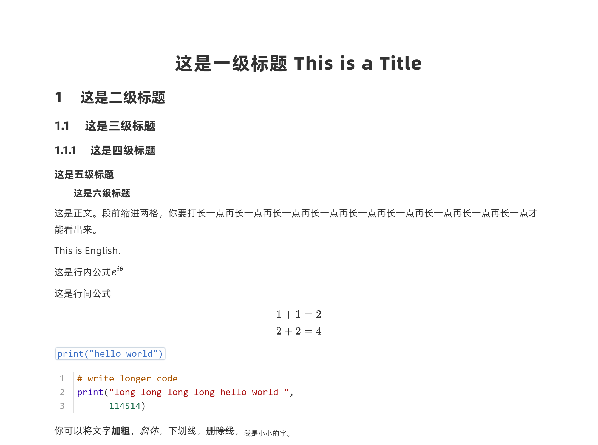
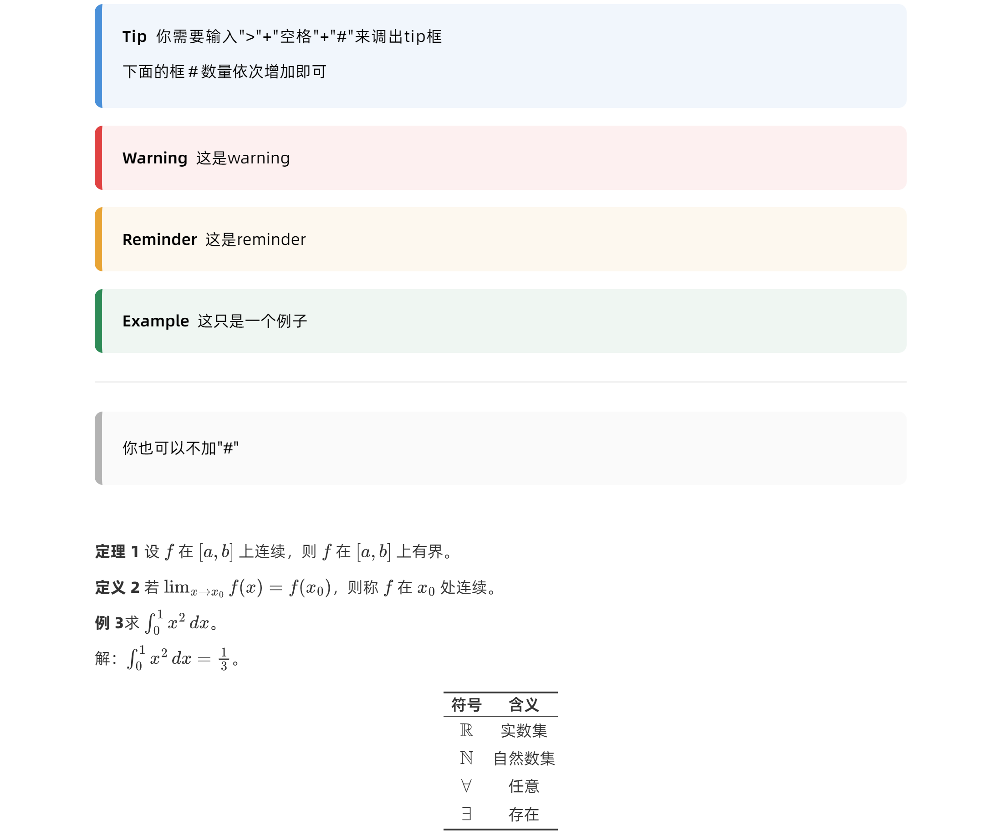

# BetterNote — Typora CSS Theme

A Typora theme for writing Markdown with a LaTeX-like look. Numbered headings, colored callout blocks, three-line tables, and math-friendly typography.

## Screenshots

  

  

remark: The new version removed the default indent before paragraphs.

## Features

- Numbered headings (h2–h4 auto-numbered, h5/h6 paragraph-style)
- Colored callout blocks: Tip (blue), Warning (red), Reminder (orange), Example (green)
- Three-line table styling
- Math-friendly font sizing
- Print-ready page breaks and margins

## Quick Start

1. Copy `better-note.css` to your Typora theme folder:
   - Windows: `%APPDATA%\Typora\themes\`
   - macOS: `~/Library/Application Support/abnerworks.Typora/themes/`
   - Linux: `~/.config/Typora/themes/`
2. Open Typora → Preferences → Appearance → Theme, select **BetterNote**.

### Fonts (Optional)

The `fonts/` folder contains **Latin Modern Mono** (monospace) under the [GUST Font License](fonts/GUST-FONT-LICENSE.TXT). You can download 阿里巴巴普惠体2.0 from its [official website]((https://www.alibabafonts.com/)). Install them for best experience, or you can customize (see below). 

| Font | Usage | Where to get |
|------|-------|-------------|
| Latin Modern Mono | Code blocks | Included in `fonts/` |
| 阿里巴巴普惠体 2.0 | Body & UI text | [Official website](https://www.alibabafonts.com/) |

## Customization

Open `better-note.css` and edit the CSS variables in `:root` — font sizes, colors, margins, and more.

## Credits

I was inspired by those beautiful themes. 

- [Keldos-Li/typora-latex-theme](https://github.com/Keldos-Li/typora-latex-theme)
- [LSTM-Kirigaya/typora-haru-theme](https://github.com/LSTM-Kirigaya/typora-haru-theme)

## License

MIT
